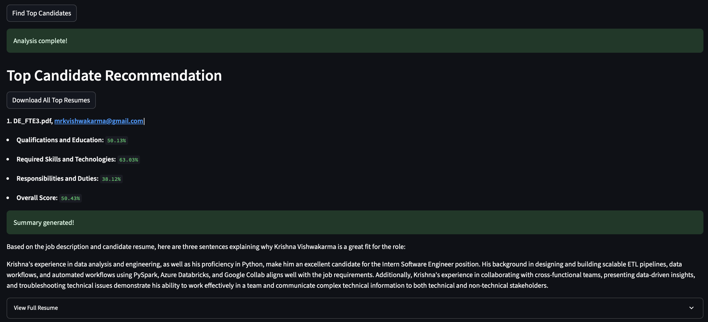

# Candidate Recommendation Agent 🤖


## 📖 Introduction

The **Candidate Recommendation Agent** is a powerful web application designed to assist recruiters and hiring managers in quickly identifying the best-fit candidates for a job opening. By leveraging advanced Natural Language Processing (NLP) techniques, the tool semantically compares a job description with multiple resumes, providing a ranked recommendation based on a similarity score.

The application includes a bonus feature that uses the **Groq API** to generate a concise, AI-powered summary explaining why the top candidate is a strong match for the role.

## ✨ Features

-   **Semantic Search:** Ranks candidates based on the semantic similarity between their resume and the job description using a pre-trained Sentence-Transformer model.
-   **Multiple File Support:** Seamlessly handles resumes in both **.txt** and **.pdf** formats.
-   **Configurable Embedding Method:** Allows users to choose between two embedding strategies for more accurate results:
    -   **Full Resume:** Compares the entire text of the job description and resume.
    -   **Key Sections:** Focuses the comparison on key sections like "Summary," "Experience," and "Skills" for both the resume and the job description.
-   **Instant AI Summary:** Generates a quick, 3-4 sentence summary for the top candidate using Groq's high-speed inference.
-   **Intuitive UI:** Built with Streamlit for a simple and responsive user experience.

## ⚙️ How It Works (Architecture)

The system is a clear, end-to-end pipeline that takes user input and produces a recommendation.

  
### 1.  **Input:** The user provides a job description and uploads resumes.
### 2.  **User Input:** The application reads the content from both `.txt` and `.pdf` files.
### 3.  **File Pre-Processing:** Based on the user's selected **Embedding Method**, the application either uses the full text or extracts key sections from both the job description and the resumes.
### 4.  **Embedding:** The pre-processed texts are converted into numerical vectors (embeddings) using a **Sentence-Transformer model**.
### 5.  **Similarity Calculation:** The cosine similarity between the job description embedding and each resume embedding is calculated to determine a match score.
### 6.  **Ranking:** Candidates are sorted by their similarity score, and the highest-ranked candidate is displayed.
### 7.  **AI Summary:** When requested, the full job description and the top candidate's resume are sent to the **Groq API** to generate a concise summary.

## 🔧 Technologies Used

-   **[Streamlit](https://streamlit.io/)**: For building the interactive web application.
-   **[Groq API](https://groq.com/)**: For fast and efficient AI summary generation.
-   **[Sentence-Transformers](https://www.sbert.net/)**: To generate high-quality text embeddings.
-   **[pdfplumber](https://github.com/jsvine/pdfplumber)**: For extracting text from PDF files while preserving some formatting.
-   **[scikit-learn](https://scikit-learn.org/)**: To calculate cosine similarity.
-   **[python-dotenv](https://pypi.org/project/python-dotenv/)**: For managing API keys securely.

## 📸 Screenshots

Here are a few screenshots to demonstrate the application's user interface and functionality.

### **1. Input**
A screenshot showing the main application with the job description text area, resume file uploader, and embedding method selector.


### **1. Output**
A screenshot showing the output for the given job descriptions and resume uploaded with the calculated similarity score.


## 🚀 Setup and Installation

Follow these steps to get the application up and running on your local machine.

### Prerequisites

-   Python 3.9 or higher

### Steps

1.  **Clone the repository:**
    ```bash
    git clone [https://github.com/your-username/your-repo-name.git](https://github.com/your-username/your-repo-name.git)
    cd your-repo-name
    ```
    (Replace with your actual GitHub repository URL)

2.  **Create and activate a virtual environment:**
    ```bash
    python -m venv venv
    # On Windows
    .\venv\Scripts\activate
    # On macOS/Linux
    source venv/bin/activate
    ```

3.  **Install the dependencies:**
    ```bash
    pip install -r requirements.txt
    ```

4.  **Set up your Groq API key:**
    -   Go to the [Groq Console](https://console.groq.com/) and create an API key.
    -   Create a new file named `.env` in the root directory of the project.
    -   Add your API key to the file like this:
    ```env
    GROQ_API_KEY="your-groq-api-key-here"
    ```

## 🖥️ Usage

Run the Streamlit application from your terminal:

```bash
streamlit run app.py